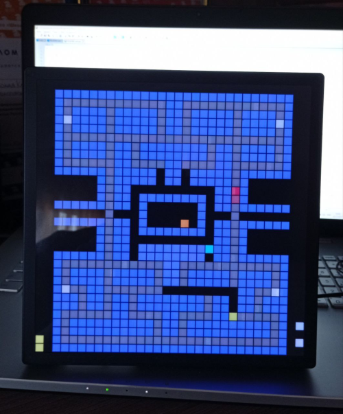

<br/>
<p align="center">
  <a href="https://github.com/rostvel/python3-idotmatrix-pacman">
    
  </a>

  <h3 align="center">Python3 iDotMatrix Pac-Man game</h3>

  <p align="center">
    iDotMatrix Pac-Man game for 32x32 pixel iDotMatrix displays
    <br/>
    <br/>
  </p>
</p>

  


## Table Of Contents

* [About the Project](#about-the-project)
* [Built With](#built-with)
* [Getting Started](#getting-started)
  * [Prerequisites](#prerequisites)
  * [Installation](#installation)
* [Usage](#usage)
* [License](#license)
* [Authors](#authors)

## About The Project

This repository is low-resolution take on the classic game for pixel screen displays iDotMatrix like [this one on Aliexpress](https://de.aliexpress.com/item/1005006105517779.html) of Pac-Man. The player is just 1-pixel in size. I wrote code for the game, following of the ported C-code by [Mike Szczys](https://github.com/szczys/matrixman) and the part of original Python code [Kalle](https://github.com/derkalle4/python3-idotmatrix-client).

## Built With

* [Python 3](https://www.python.org/downloads/)
* [iDotMatrix Library](https://github.com/derkalle4/python3-idotmatrix-library)
* [argparse](https://docs.python.org/3/library/argparse.html)
* [asyncio](https://docs.python.org/3/library/asyncio.html)
* [bleak](https://github.com/hbldh/bleak)
* [pillow](https://python-pillow.org)

## Getting Started

To get a local copy up and running follow these simple example steps:

### Prerequisites

Please install the following for your OS:

* latest Python3
* Python3 Virtual Env

windows users, to use the `.sh` scripts below you will need to use msys/gitbash, or roll your own

### Installation

1. Clone the repo

```sh
git clone https://github.com/rostvel/python3-idotmatrix-pacman.git
```

2. Create virtual environment and install all dependencies

```sh
./create_venv.sh
```

## Usage

If you used the ./create_venv.sh you should use this command to run the app:

```sh
./run_in_venv.sh <YOUR_COMMAND_LINE_ARGUMENTS>
```
If you do not use a virtual environment the command will look like this:

```sh
python3 .\app.py <YOUR_COMMAND_LINE_ARGUMENTS>
```

#### command line arguments

##### --address (required for all commands except "scan")

Specifies the address of the pixel display device. Use "auto" to use the first available device (automatically looking for IDM-* devices in range).

```sh
./run_in_venv.sh --address 00:11:22:33:44:ff
```

##### --scan

Scans all bluetooth devices in range for iDotMatrix devices. Quits afterwards. Cannot be combined with other commands (use --address auto instead).

```sh
./run_in_venv.sh --scan
```

##### --sync-time

Sets the time of the device to the current local time.

```sh
./run_in_venv.sh --address 00:11:22:33:44:ff --sync-time
```

##### --set-brightness

Sets the brightness of the screen in percent: range 5..100

```sh
./run_in_venv.sh --address 00:11:22:33:44:ff --set-brightness 40
```

##### --game

Start the Game

```sh
./run_in_venv.sh --address 00:11:22:33:44:ff --game
```

### Features
* **Device Search**: *Scans for nearby devices, asks for name, adds to home screen.*
* **Sync Time**: *Sync time to machine clock.*
* **Set Brightness**: *Sets the brightness to machine in percent.*
* **Start Game**: *Start Game.*

</br>

### Creating A Pull Request

1. Fork the Project
2. Create your Feature Branch (`git checkout -b feature/AmazingFeature`)
3. Commit your Changes (`git commit -m 'Add some AmazingFeature'`)
4. Push to the Branch (`git push origin feature/AmazingFeature`)
5. Open a Pull Request

## License

Distributed under the GNU GENERAL PUBLIC License. See [LICENSE](https://github.com/derkalle4/python3-idotmatrix-client/blob/main/LICENSE) for more information.

## Authors

* [Kalle Minkner](https://github.com/derkalle4) - *Command client*
* [Mike Szczys](https://github.com/szczys) - *Matrixman code by C-language*
